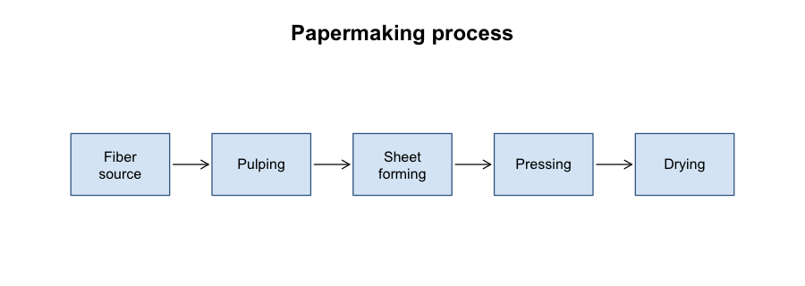

# A Short History of Papermaking

Papermaking is traditionally traced to Cai Lun, an official at the Han
imperial court, who is credited with standardizing a pulp-based process
around 105 CE. The technique spread slowly westward over the following
centuries, reaching the Islamic world by the eighth century and Europe by
the twelfth.

## Materials and process

Early paper was made from a mixture of fibrous materials, including:

- mulberry bark
- hemp waste
- old rags and fishing nets
- bamboo, in later regional variants

The fibers were pulped, suspended in water, and lifted out on a mesh
screen. Pressing and drying removed the remaining water, leaving a
flexible, foldable sheet -- a considerable improvement over papyrus or
parchment for everyday writing.

## Comparative costs

The table below gives illustrative relative costs of common writing
surfaces before and after paper became widely available.

| Surface   | Relative cost | Durability |
|-----------|---------------|------------|
| Papyrus   | Medium        | Low        |
| Parchment | High          | High       |
| Paper     | Low           | Medium     |

## A simple diagram

The figure below sketches the basic pulp-to-sheet process.

## Later developments

Mechanized paper production in the nineteenth century, driven by the
Fourdrinier machine, shifted the raw material from rags to wood pulp and
made paper cheap enough for mass printing. This is the point at which
paper stopped being a craft good and became an industrial commodity.
